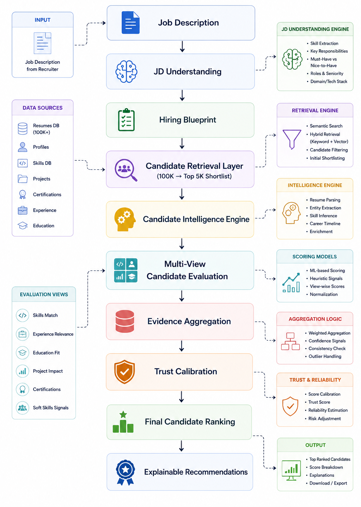
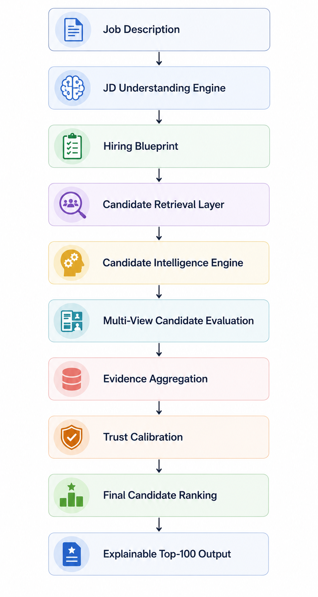

# HireFormer
### Transformer-Inspired Hiring Intelligence

HireFormer is an intelligent candidate ranking system that understands both **Job Descriptions** and **candidate profiles** to generate an **explainable, trustworthy, and scalable Top-100 candidate shortlist**. Instead of relying on traditional keyword matching, the system evaluates multiple dimensions of candidate suitability through structured job understanding, evidence-based ranking, and trust calibration.

---

# Problem Statement

Traditional keyword-based candidate screening often overlooks qualified candidates by failing to understand the complete hiring context.

HireFormer addresses this challenge by understanding both **job requirements** and **candidate profiles** beyond keyword matching, enabling recruiters to identify the most relevant candidates through explainable and evidence-based ranking.

---

# Key Features

- 📄 Intelligent Job Description Understanding
- 📋 Hiring Blueprint Generation
- 🚀 Two-Stage Candidate Retrieval Pipeline (100K → Top 5K)
- 🧠 Multi-View Candidate Evaluation
- 📊 Evidence-Based Candidate Ranking
- 🛡️ Trust Calibration
- 💡 Explainable Candidate Recommendations
- ⚡ CPU-only Offline Execution
- 💻 Interactive Streamlit Recruiter Dashboard

---

# System Architecture

<p align="center">
  
</p>

---

# End-to-End Workflow

<p align="center">
  
</p>

---

# Performance

| Metric | Value |
|---------|-------|
| Candidate Profiles Processed | 100,000 |
| Retrieval Pipeline | 100K → Top 5K |
| Final Recommendations | Top 100 |
| End-to-End Runtime | ~60 seconds |
| Execution | CPU Only |
| Network Access | Not Required |

---

# Technologies Used

| Technology | Purpose |
|------------|---------|
| Python | Core Ranking Engine |
| Streamlit | Recruiter Dashboard |
| Pandas | Data Processing |
| NumPy | Numerical Operations |
| python-docx | Job Description Parsing |
| JSON / JSONL | Candidate Dataset |
| Plotly | Candidate Visualizations |

---

# Installation

Clone the repository

```bash
git clone https://github.com/Rithika-Shankar/redrob-hireformer.git
```

Install the required dependencies:

```bash
pip install -r requirements.txt
```

---

# Run the Recruiter Dashboard

```bash
streamlit run app.py
```

The dashboard supports:

- **Demo Mode** using the official sample dataset
- **Upload Mode** for ranking the complete candidate dataset

---

# Generate the Final Submission

Place the official `candidates.jsonl` file inside the `data/` directory and run:

```bash
python rank.py --mode fast --shortlist-size 5000 --candidates data/candidates.jsonl --out submission.csv
```

---

# Validate the Submission

```bash
python validate_submission.py submission.csv
```

---

# Dataset

The repository contains the official sample dataset for demonstration purposes.

The complete `candidates.jsonl` dataset is intentionally **not included** due to its large size. To reproduce the final rankings, place the official dataset in the `data/` directory before running the ranking command.

---

# Output

The generated submission follows the official challenge format and contains:

- Candidate ID
- Rank
- Final Score
- Explainable Reasoning

---

# Highlights

- Transformer-inspired ranking architecture
- Explainable candidate recommendations
- Multi-view candidate evaluation
- Evidence aggregation and trust calibration
- Scalable retrieval pipeline
- Offline CPU-only execution
- Interactive recruiter dashboard

---

# Author

**Rithika Shankar**

---

Built for the **Redrob Intelligent Candidate Ranking Challenge**.
